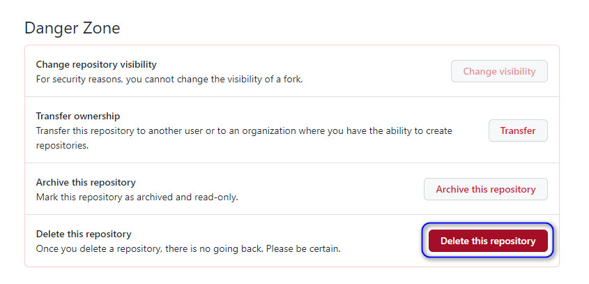
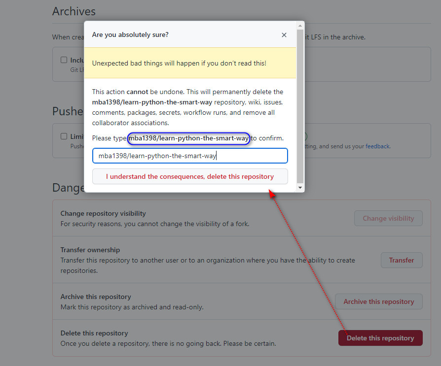

How to delete one repository? 如何删除一个 github 中的仓库？

- 1
- 步骤1：进入自己待删除的仓库，选择 Settings，如下图所示

- 2
- 步骤2：在Settings页面找到 Danger Zone，选择 Delete this repository

- 3
- 步骤3：二次确认，输入仓库名称，点击 `I understand the consequences, delete the repository`

