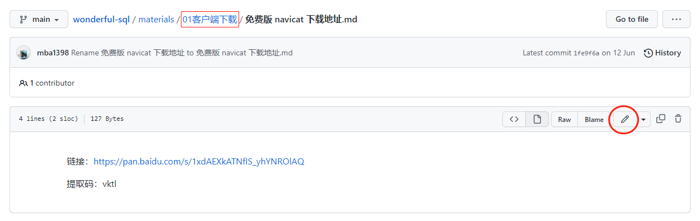
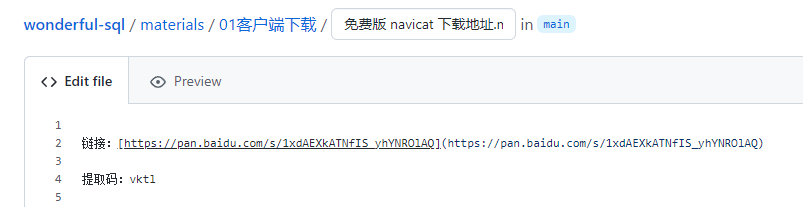
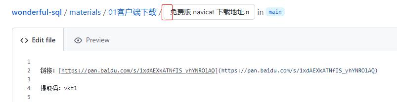
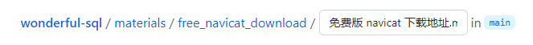

Thus, you want to change the folder's name. You can do it like this.

- Fisrt: Click the edit menu.

- Second: You can see the change.

- Third: Place the cursor to the left of the first word of the file name.

- 4th: Press Backspace menu, edit the floder's name, split folder and file with `/` 

- 5th: Save your change.

